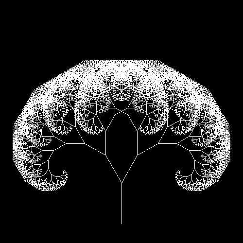
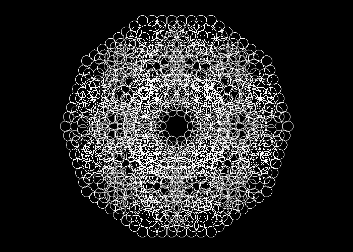

# Fractals
Fractals is a web app for generating fractals via recursion for a set amount of iterations,
and is run on 
[Spring Framework](https://spring.io/)
in Java.

## Fractal Types
Currently the user may generate and play around with 2D fractal types
[Fractal Tree](src/main/java/com/fractals/FractalTree.java),
[Fractal Circles](src/main/java/com/fractals/FractalCircle.java), and
[Fractal Flower](src/main/java/com/fractals/FractalFlower.java).

### Fractal Tree
A [FractalTree](src/main/java/com/fractals/FractalTree.java)
branches from a parent line segment into two child segments each iteration that change in scale
depending on the scaling factor.
Each iteration *i* generates 2*i* line segment nodes.

This Fractal Tree was created with 14 iterations, 
an angle of 60 degrees between child nodes, 
and a scaling factor of 0.77, meaning each child line segment is 77% as long as its parent.

### Fractal Circles
[FractalCircle](src/main/java/com/fractals/FractalCircle.java)
generates a set number of child circle 'satellites' each iteration that intersect with the parent circle at a single point.
Every iteration satellite radius changes proportionally to the scaling factor.
With *s* satellites, each iteration *i* generates *s**i* circle satellites.

These Fractal Circles were generated with only 4 iterations, 10 satellites, and a scaling factor of 0.5,
meaning each satellite has half the radius of its parent and thus a quarter of the area.

### Fractal Flower
A [FractalFlower](src/main/java/com/fractals/FractalFlower.java) is generated somewhat similarly to Fractal Circles in that
generation begins with a parent circle, and each iteration draws child arc petals around the parent spanning a given amount
of degrees (parameter *Arc Angle*) as opposed to Fractal Circles which draws child arcs with 
a fixed arc angle of 360 degrees (whole circles).
Each iteration the radius used to generate the child petal arc changes proportionally to a *raisedScalingFactor*,
which is set by the relationship *raisedScalingFactor* = *f* *p* / 2
for scaling factor parameter *f* and scaling power parameter *p*. 
For example, if *p* = 2, child petals will change in size quadratically relative to the parent.
With *s* petals, every iteration *i* generates *s**i* child petals.

This Fractal Flower was generated with 5 iterations, 8 petals, an arc angle of 180 degrees, 
a scaling factor of 0.5, and a scaling power of 2.0.

